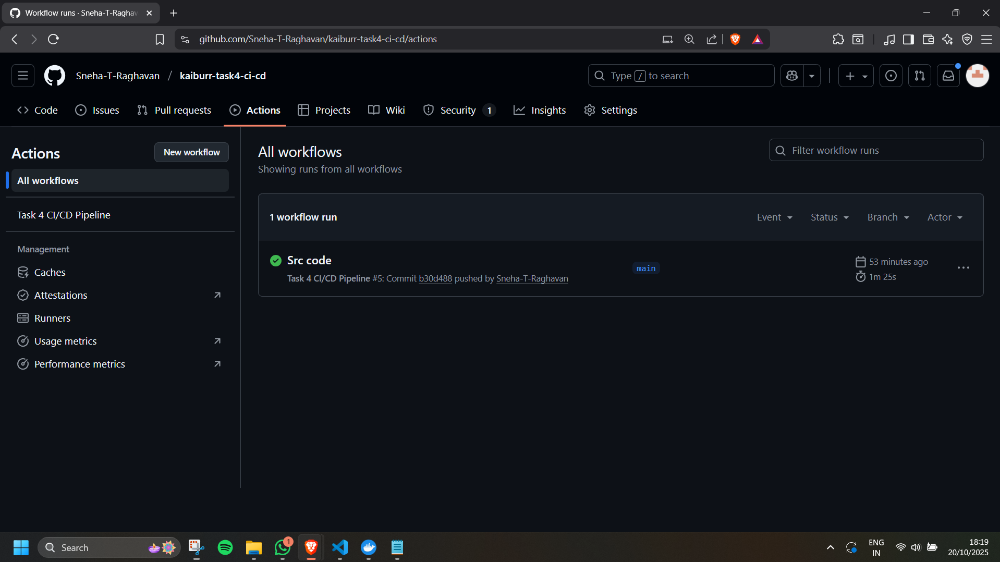
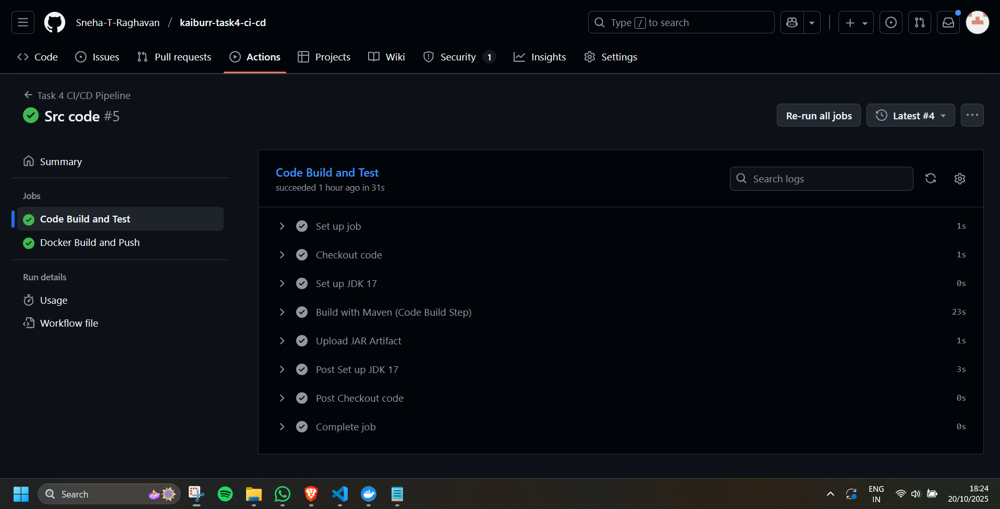
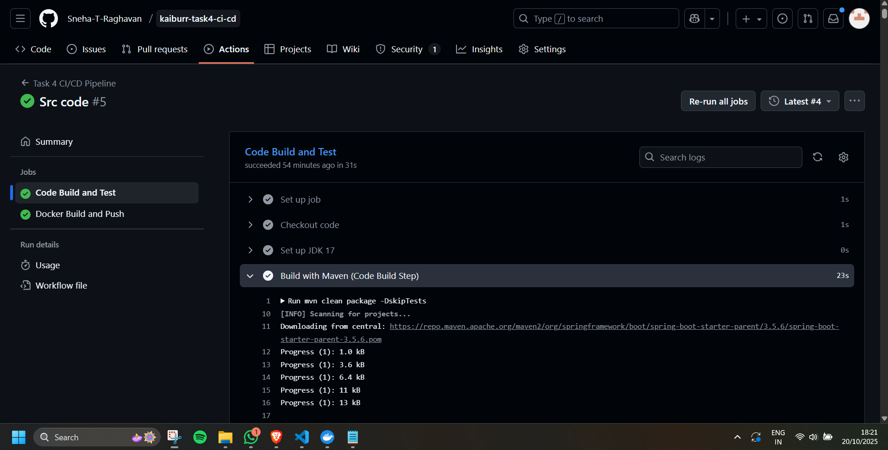
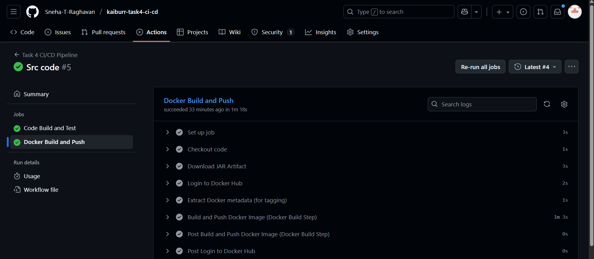
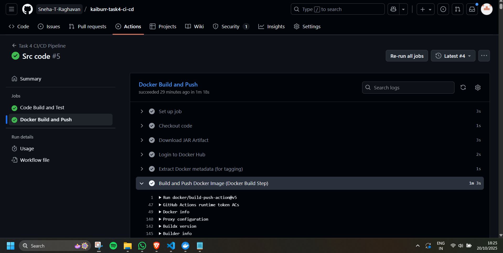

# Task 4: CI/CD Pipeline

# Overview
This repository implements a complete CI/CD pipeline using GitHub Actions for the Task Manager application from Task 1. The pipeline includes automated code builds, testing, and Docker image creation.

# Pre-Requisites
- Java 17
- Maven 3.9+
- Docker
- GitHub

# Setup Instructions

1. Clone This Repository
2. Configure GitHub Secrets
Add these secrets:

| Secret Name | Description | How to Get |
|-------------|-------------|------------|
| `DOCKER_USERNAME` | Docker Hub username | Your Docker Hub username |
| `DOCKER_PASSWORD` | Docker Hub access token | Generate at hub.docker.com → Account Settings → Security → New Access Token |

4. Trigger the Pipeline
    - Make a change and Commit to trigger the pipeline

5. Monitor Workflow 
    - Use Github Actions to monitor workflow and see logs

# Screenshots
Pipeline Overview

Code Build Overview

Maven Build Stage Logs

Docker Build Overview

Docker Build Stage

